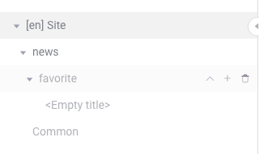
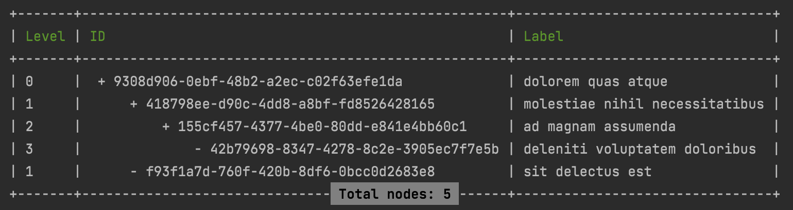

# Laravel Tree Structure


[](https://packagist.org/packages/efureev/laravel-trees)
[](https://packagist.org/packages/efureev/laravel-trees)
[](https://packagist.org/packages/efureev/laravel-trees)
[](https://packagist.org/packages/efureev/laravel-trees)
[](https://codeclimate.com/github/efureev/laravel-trees/maintainability)
[](https://codeclimate.com/github/efureev/laravel-trees/test_coverage)

A Laravel package for implementing multi-tree hierarchical structures using the Nested Set Model.

## Overview

This package supports Multi-Tree structures (multiple root nodes) and allows movement of nodes between trees.
It works with various model primary key types: `int`, `uuid`, and `ulid`.

## Key Advantages

- **Multi-Tree Support**: Manage multiple independent trees within the same table
- **Cross-Tree Operations**: Move nodes between different trees with ease
- **Flexible Primary Keys**: Works with various key types including `int`, `uuid`, and `ulid`
- **Comprehensive Tree Health Tools**: Built-in validation and repair utilities for tree integrity
- **Performance Optimized**: Efficiently retrieves hierarchical data with minimal database queries
- **Modern PHP Support**: Utilizes modern PHP 8.x features and strict typing
- **Flexible Configuration**: Highly customizable attribute naming and behavior
- **Well Documented**: Complete documentation with practical examples
- **Thoroughly Tested**: Comprehensive test suite ensuring reliability

### What are nested sets?

[Nested Set Model](http://en.wikipedia.org/wiki/Nested_set_model) is an efficient way to store hierarchical data in
relational databases:

> The nested set model numbers nodes according to a tree traversal, which visits each node twice, assigning numbers in
> the order of visiting, and at both visits. This leaves two numbers for each node, which are stored as attributes.
> Querying becomes inexpensive: hierarchy membership can be tested by comparing these numbers. Updating requires
> renumbering and is therefore expensive.

### Ideal Use Cases

NSM shows good performance when:

- Trees are updated infrequently
- Fast retrieval of related nodes is needed
- Building multi-depth menus or category structures

## Visualization

<div>
  
  
</div>

## Requirements

- PHP: 8.2|8.3|8.4
- Laravel: ^11.*

It is highly recommended to use a database that supports transactions (like PostgreSQL) to protect tree structures from
corruption.

## Installation

```shell
composer require efureev/laravel-trees
```

## Documentation

- [Basic Usage](./docs/Basic.md)
- [Advanced Tree Configuration](./docs/AdvancedTreeConfig.md)
- [Database Migration](./docs/Migration.md)
- [Creating Nodes](./docs/CreatingNodes.md)
- [Managing Nodes](./docs/ManagingNodes.md)
- [Retrieving Nodes](./docs/ReceivingNodes.md)
- [Model Helpers](./docs/Helpers.md)
- [Console Commands](./docs/Console.md)
- [Health Checks and Fixing](./docs/HealthAndFix.md)

## Testing

```shell
./vendor/bin/phpunit --testdox
# or
composer test
```