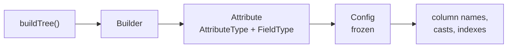
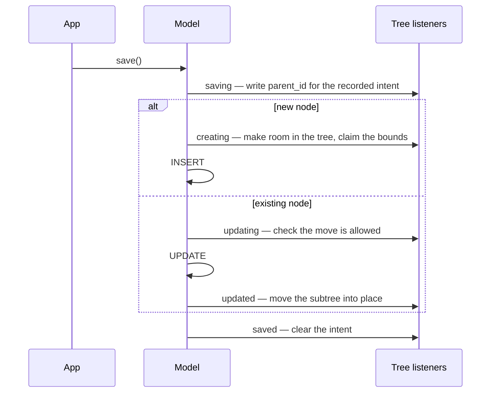

# Architecture

> **Read this once, early.** Most surprises with this package — why `appendTo()` seems to do
> nothing, why a query-level delete breaks the tree — stop being surprising once you know how
> the pieces fit.

## The shape of the data

A tree is stored as five columns on your own table. There is no pivot table and no join table.

| Column | Default name | Holds |
|---|---|---|
| Left bound | `lft` | the node's opening number |
| Right bound | `rgt` | the node's closing number |
| Level | `lvl` | depth, root is `0` |
| Parent | `parent_id` | the direct parent, `null` for a root |
| Tree | `tree_id` | which tree the node belongs to — multi-tree models only |

The bounds come from walking the tree and numbering each node twice, on the way in and on the
way out:

```
root  1 ................. 8
├── A  2 ... 3
└── B  4 ...... 7
    └── C  5 . 6
```

Everything follows from that numbering. `C` is inside `B` because `4 < 5` and `6 < 7`, which is
why a whole subtree — however deep — is one `where lft between ? and ?`, with no recursion.

The `parent_id` column is not what defines the structure; the bounds are. It is kept for direct
children, ordering and repair.

## Two shapes of tree

A **single tree** has one root and no tree column. A **multi-tree** model adds `tree_id`, and
each tree is numbered independently — every root starts at `lft = 1`.

That is why nothing but the tree column separates two trees: their bounds overlap completely.
Every query the package builds carries the tree condition for you.

## Configuration is built once

When Laravel initialises the model, the trait builds the configuration and freezes it.



- `Builder` collects one `Attribute` per column. `Builder::default()` gives a single tree,
  `Builder::defaultMulti()` adds the tree column.
- Each `Attribute` carries an `AttributeType` — which role the column plays — and a `FieldType`,
  which decides both the migration column type and the model cast.
- The result is a readonly `Config`. Nothing recomputes it per query.

The casts are merged in at the same moment, so a brand new instance already knows that `lft` is
an integer. Override `buildTree()` to change column names or types — see
[Advanced Tree Configuration](./AdvancedTreeConfig.md).

## Operations are deferred

This is the single most important thing on this page.

`makeRoot()`, `appendTo()`, `prependTo()`, `insertBefore()` and `insertAfter()` **write
nothing**. They record an intent on the model and return it, so the call can be chained. The
work happens on the next `save()`.

```php
$node->appendTo($parent);   // nothing has happened yet — no query at all
$node->save();              // now the tree is rearranged
```

> [!WARNING]
> A positioning call without `save()` is a no-op. This is the most common way to "lose" a node.

## Everything rides on model events

`save()` and `delete()` do the tree work through Eloquent's events. The package listens to eight
of them — `saving`, `creating`, `created`, `updating`, `updated`, `saved`, `deleting`, `deleted`
— and to `restoring` and `restored` as well when the model soft-deletes.



Note where the room is made: for a new node the tree is shifted **before** the row is inserted,
during `creating`. For an existing node the subtree is moved **after** the row is updated.

Two consequences worth spelling out:

- **A node must be saved and deleted through the model.** A query-level `update()` or `delete()`
  bypasses every listener, so the bounds are never adjusted and the tree breaks. See
  [Limitations](./Limitations.md#never-delete-through-a-query).
- **An intent is consumed by exactly one save.** After the save it is cleared, so a later,
  unrelated save cannot replay it.

## The builder and the collection are replaced

Models using the trait return the package's own query builder and collection, so the tree
methods are simply there:

```php
Category::query();          // QueryBuilderV2 — root(), descendantsQuery(), byTree(), leaf(), …
Category::query()->get();   // Fureev\Trees\Collection — toTree(), toBreadcrumbs(), getRoots()
```

Nothing needs registering: the package has no service provider. Adding the trait is the whole
installation.

## Relations are drawn by bounds

`ancestors` and `descendants` are real Eloquent relations, but they are not built on a foreign
key. They compare bounds, which is what lets `descendants` reach the entire subtree in one
query rather than one query per level.

That is also why they carry a tree condition of their own: without it, two trees with identical
bounds would bleed into each other.

## Deleting is a strategy

What happens to the children of a deleted node is a replaceable strategy, not a hard rule.

| Point | Default | Interface |
|---|---|---|
| Children of a deleted node | `MoveChildrenToParent` — pull them up one level | `ChildrenHandler` |
| `deleteWithChildren()` | `DeleteWithChildren` — remove the subtree | `DeleteStrategy` |

Swap them on the builder with `setChildrenHandlerOnDelete()` and `setDeleterWithChildren()`.

## Tree identifiers

For multi-tree models the tree id is generated when a root is created and none was given:

| Column type | Generated value |
|---|---|
| Integer | `max(tree_id) + 1` |
| UUID | UUID v7 |
| ULID | lowercase ULID |

Because the integer generator counts upward from the current maximum, it never produces `0` —
but you may set `0` yourself with `setTree(0)`.

## Schema and indexes

`Migrate` adds the columns and three indexes, matching how the package queries:

| Index on | Serves |
|---|---|
| `rgt` | closing-bound lookups and gap shifting |
| `parent_id` | direct children |
| `lft, rgt` | subtree and ancestor ranges |

On a multi-tree model the tree column is prepended to each of them, since every query is scoped
by tree first. See [Database Migration](./Migration.md).

## Integrity

Bounds can drift — a crashed move without a transaction, a manual `UPDATE`, an import. The
package ships checks for that, and a repair trait whose status is worth reading before you rely
on it: [Health Checks and Fixing](./HealthAndFix.md).

## Related

- [Concepts](./Basic.md) — the model and the two tree shapes
- [Limitations](./Limitations.md) — what this design costs and what it forbids
- [Managing Nodes](./ManagingNodes.md) — the operations themselves
