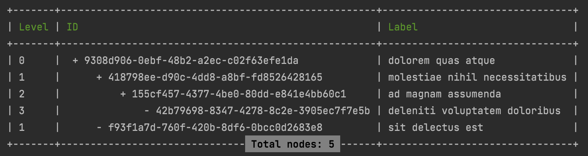

# Console Output

Render a tree as an indented table, for artisan commands and debugging.



## From a node

The node and everything under it:

```php
use Fureev\Trees\Table;

Table::fromModel($root)->draw();
```

Without an output object it writes to a buffered console output. Pass one to control where it
goes — inside an artisan command, that is `$this->output`:

```php
Table::fromModel($root)->draw($this->output);
```

## From a collection

When the collection is already loaded and linked, render it without touching the database again:

```php
Table::fromTree(Category::query()->defaultOrder()->get()->toTree())
    ->hideLevel()
    ->setExtraColumns(['title' => 'Label'])
    ->draw($output);
```

## From a query

```php
(new Table())
    ->fromQuery(Category::query()->defaultOrder())
    ->setExtraColumns(['title' => 'Label'])
    ->draw($output);
```

> [!NOTE]
> `fromQuery()` is an **instance** method, while `fromModel()` and `fromTree()` are static. It
> has to be reached through `new Table()`.

## Choosing the columns

By default the table prints the tree columns. `setExtraColumns()` replaces that with the columns
you name, mapping column to heading:

```php
Table::fromModel($root)
    ->setExtraColumns([
        'title'                          => 'Label',
        (string)$root->leftAttribute()   => 'Left',
        (string)$root->rightAttribute()  => 'Right',
    ])
    ->draw($output);
```

An `Attribute` casts to its column name, so `(string)$root->leftAttribute()` survives a rename of
the underlying column.

## Adjusting the look

| Method | Does |
|---|---|
| `hideLevel()` | drop the level column |
| `setOffset(string $offset)` | change the indent used per level — four spaces by default |
| `setOutput(?OutputInterface $output)` | set the output without drawing yet |

## What it costs

`fromModel()` and `fromQuery()` each run one query. `fromTree()` runs none — the collection is
already in memory.

## Related

- [Collections](./Collections.md) — building the tree the table renders
- [Retrieving Nodes](./ReceivingNodes.md) — getting the nodes in the first place
